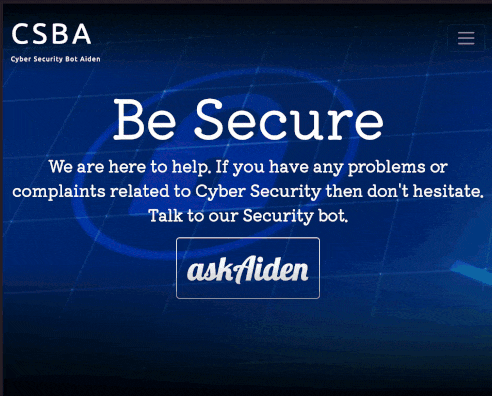
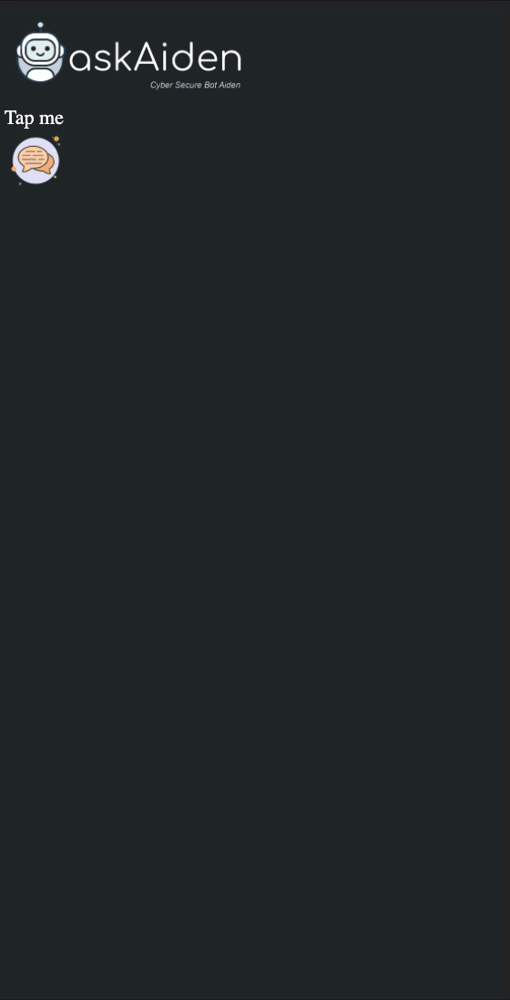

# Cyber Security

The site CSBA (Cyber Security Bot Aiden) provides information on Cyber Security in India. Users can get help through our chatbot "askAiden". Aiden not only provides links and Helplines for the registration of complaints but also links the users to Cyber Security courses available in India. It will also provide Information on Unlawful content as provided at Ministry of Home Affairs.

Site link: https://csba.herokuapp.com/ (NOTE: Due Heroku no longer providing free Tier, site is down, kept the repo as public to serve as template)

# askAiden

Our bot provides features like Online Complaint through Ministry of Home Affairs, an All-India Toll number. Even if these methods didn't work due to some technical issues, Aiden will provide Helplines present in your state and also provide a link for contact details of State/UT Nodal Officer and Grievance Officer.

# Technology Stack

HTML  
CSS  
Bootstrap  
JavaScript  
JQuery  
Node.js  
Express.js  

# Credit

Shashank sahu - Team Leader, Server, Design  
Vinayak Raj - Chatbot Interface and Design  
Rahul Kalia - Research, Design  
